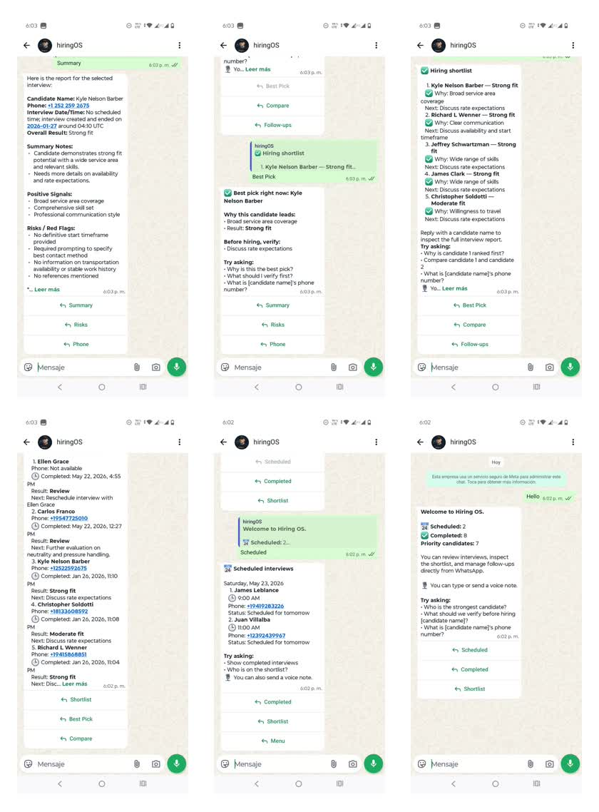

# Inspector Recruiting Prototype

This repository demonstrates the ability to build AI-powered product validation systems with real architecture, domain-shaped business logic, and operational usability in a very short time frame.

The prototype validates a recruiting workflow for field inspectors through:

- a conversion-focused public landing page
- immediate or scheduled AI voice interviews
- structured interview persistence in Supabase
- track-aware hiring intelligence
- a WhatsApp operator that gives hiring leads operational visibility without requiring an internal dashboard

This is not presented as a finished recruiting product. It is presented as a functional prototype designed to prove whether a workflow, operating model, and intelligence layer are worth turning into a fuller platform.

Live prototype: [home-insp-inter.vercel.app](https://home-insp-inter.vercel.app/)

Try the WhatsApp operator: [`+57 314 344 9324`](https://wa.me/573143449324)


## Visual Walkthrough





Additional visuals:

- [Visual Gallery](docs/visual-gallery.md)
- [WhatsApp Menu](docs/assets/whatsapp-menu.jpg)
- [Scheduled Interviews](docs/assets/whatsapp-scheduled.jpg)
- [Completed Interviews](docs/assets/whatsapp-completed.jpg)
- [Hiring Shortlist](docs/assets/whatsapp-shortlist.jpg)
- [Best Pick](docs/assets/whatsapp-best-pick.jpg)
- [Candidate Summary](docs/assets/whatsapp-summary.jpg)

## What This Prototype Proves

- A product idea can move from concept to working operational system in roughly 48 hours.
- AI becomes more useful when it is shaped by workflow rules, role logic, and operational constraints.
- A prototype does not need a full internal platform to validate value; an operational surface like WhatsApp can be enough.
- Deterministic orchestration plus peripheral LLM usage is a stronger pattern than LLM-first workflow design.
- Structured persistence turns a demo into a reusable product foundation.

## Business Problem

Hiring teams often need to answer a product question before they need to answer a software-scaling question.

In this case, the product question was:

Can we validate an inspector recruiting workflow that attracts candidates, runs voice interviews, persists evaluation output, and gives operators a usable operational view in real time?

Instead of investing first in a full recruiting platform, this prototype validates the business flow directly:

1. attract candidates through a focused landing page
2. let candidates start now or schedule later
3. execute and persist voice interviews
4. evaluate candidates through role-shaped hiring intelligence
5. let operators inspect the workflow through WhatsApp

## What Was Built

### Candidate acquisition and intake

- Inspector recruiting landing page
- Guided modal for `call_now` and `schedule_call`
- Candidate and interview session creation in Supabase

### Voice interview execution

- Immediate call dispatch for `call_now`
- Scheduled dispatch path for `schedule_call`
- Outbound interview execution through Retell
- Cron-based due interview promotion using `pg_cron + pg_net`

### Hiring operations surface

- WhatsApp operator with deterministic menus and lists
- Scheduled interviews, completed interviews, shortlist, best pick, and follow-up flows
- Candidate selection by name, index, or phone digits
- Voice note support for operator queries

### Hiring intelligence layer

- Transcript extraction and structured interview interpretation
- Inspection-specific evaluator for neutral-inspector fit
- Geographic reach and coverage scoring based on ZIP and travel limit
- Structured persistence into `candidate_intelligence` and `interview_session`
- Architecture prepared for multiple hiring tracks and multiple evaluation paths

## Why The Intelligence Layer Matters

This prototype is not only a workflow shell around APIs.

Its differentiator is that interview intelligence is treated as domain logic.

The current live implementation centers on the **inspection** hiring track, where evaluation is shaped around:

- neutrality
- language boundaries
- pressure handling
- operational discipline
- trainability

That matters because the product is not asking, “Is this a good candidate in general?”

It is asking, “Is this the right kind of candidate for this specific role, under this specific hiring logic?”

The repo also shows a broader architecture prepared for additional hiring paths such as:

- trades
- sales
- management

and for evaluation models driven by `role_truth`, focus areas, pressure level, follow-up style, and depth expectation.

## Architecture Principles

These are the decisions that make the prototype useful rather than theatrical.

- **Determinism owns workflow state**  
  Lists, selection, navigation, and factual responses are code- and database-driven.

- **The LLM sits at the edge**  
  It is used for transcription, synthesis, comparison, and grounded Q&A, not for inventing workflow facts.

- **One system of record serves multiple surfaces**  
  Candidate flow, scheduled dispatch, completed interview visibility, and operator reporting all sit on shared persisted state.

- **Track-aware intelligence beats generic AI summaries**  
  Role-specific prompts and schemas create more valuable outputs than generic “candidate summaries.”

- **Prototype speed does not require architecture shortcuts**  
  Fast delivery is more useful when the prototype is built like a real system, not like a disposable mockup.

## What We Learned

- **Product validation compresses well when channels are chosen deliberately.**  
  For this workflow, WhatsApp is a strong operational surface because it lowers the cost of adoption for the hiring lead.

- **The combination of deterministic orchestration and peripheral LLM usage is highly reliable.**  
  It reduces ambiguity, keeps list and state responses honest, and still allows AI to add value where language actually matters.

- **AI evaluation becomes more credible when it is constrained by role logic.**  
  The inspection track works because the evaluator is not generic; it is strict, bounded, and explicitly shaped by the role.

- **Structured persistence is what separates a demo from a product foundation.**  
  Saving transcript, intelligence, scheduling state, and operator state in one system makes downstream features easier to build.

- **A meaningful prototype can validate operations, not just interface.**  
  The value is not only in the landing page or the chatbot. It is in proving that the workflow can actually be run.

## What Comes Next

The natural expansion of this system is not “more screens.” It is deeper hiring intelligence.

### Multi-stage interview intelligence

- first-screen interviews
- qualification interviews
- late-stage readiness interviews
- final-stage operational fit interviews

### Pressure-based interview models

- stress interviews for pressure-sensitive roles
- escalation handling scenarios
- boundary-testing interviews
- response-under-pressure evaluation

### Multi-track hiring paths

- inspection
- trades
- sales
- management
- other role-specific recruiting tracks

### Configurable interview control profiles

- pressure level
- follow-up style
- expected depth
- focus-area weighting

### Cross-stage candidate memory

- compare candidate performance across stages
- detect contradictions between interviews
- track improvement, consistency, and risk over time

This is where the prototype becomes a hiring intelligence platform rather than a single recruiting flow.

## Stack

- `React + Vite + TypeScript`
- `Tailwind CSS`
- `Supabase`
- `Retell`
- `OpenAI`
- `Infobip`
- `Vercel`
- `pg_cron + pg_net`

## Documentation Map

- [Project Docs](docs/README.md)
- [Portfolio Case Study](docs/portfolio-case-study.md)
- [Hiring Intelligence](docs/hiring-intelligence.md)
- [Visual Gallery](docs/visual-gallery.md)
- [WhatsApp Operator Flow](docs/whatsapp-operator-flow.md)

## Local Development

```bash
npm install
npm run dev
```

Frontend environment variables:

```bash
cp .env.example .env
```

Then set:

- `VITE_INTAKE_ENDPOINT`
- `VITE_SUPABASE_ANON_KEY`

Backend secrets live in Supabase Edge Function configuration and are not stored in this repository.
