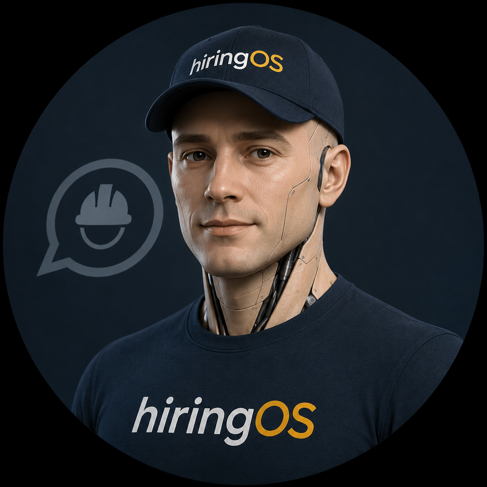
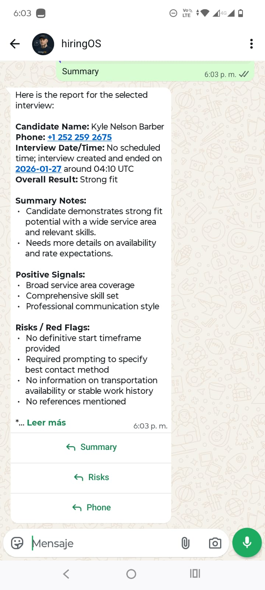
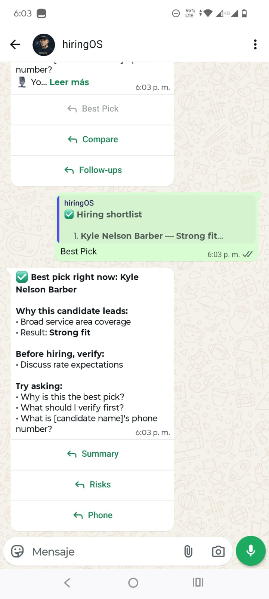
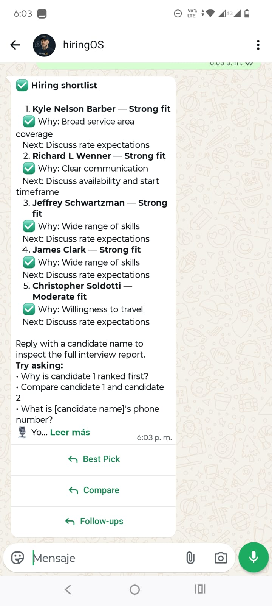
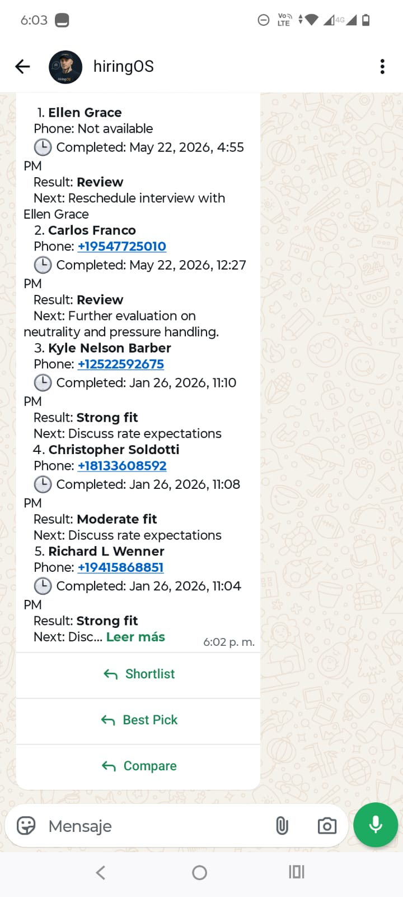
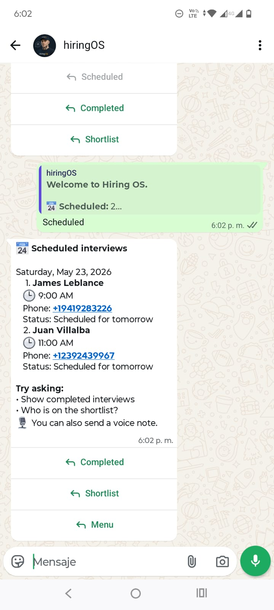
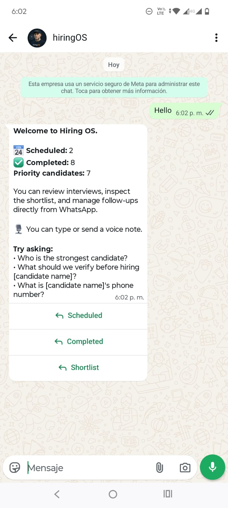

# Inspector Recruiting Prototype

Functional recruiting prototype for field inspector hiring: a landing page, instant or scheduled voice interviews, interview persistence in Supabase, and a WhatsApp operator that lets a hiring lead review interviews without opening an internal dashboard.

Live prototype: [home-insp-inter.vercel.app](https://home-insp-inter.vercel.app/)

Try the WhatsApp operator: [`+57 314 344 9324`](https://wa.me/573143449324)


## Visual Walkthrough

Hiring OS operator profile:



WhatsApp operator flow:













System architecture:


## What This Prototype Demonstrates

- A public-facing recruiting funnel built for conversion, not just presentation.
- Voice interview intake with immediate or scheduled execution.
- Persistence of interview sessions and downstream evaluation context in Supabase.
- A deterministic WhatsApp operations interface layered with LLM-assisted summaries and Q&A.
- End-to-end orchestration across Vercel, Supabase Edge Functions, Infobip, Retell, and OpenAI.

This repository represents the kind of fast-turnaround prototype I build for MVP, SaaS discovery, and AI workflow validation engagements. The goal is not to present a fully generalized product, but a working, commercially credible prototype that proves a business flow in 48-72 hours.

## Problem It Solves

Hiring teams often need to validate a recruiting workflow before investing in a full product. In this prototype, the workflow is:

1. Attract inspector candidates through a focused landing page.
2. Let candidates start now or schedule a call.
3. Persist interview data and evaluation results.
4. Give operators a lightweight WhatsApp interface to review scheduled interviews, completed interviews, and candidate outcomes in near real time.

Instead of requiring a full internal dashboard from day one, the prototype proves that operational visibility can happen inside an everyday channel like WhatsApp.

## Core Experience

### Candidate side

- Landing page tailored to inspector recruiting.
- Guided intake modal for `call_now` or `schedule_call`.
- Interview session creation in Supabase.
- Retell-powered outbound interview call.

### Operator side

- WhatsApp menu for scheduled interviews, completed interviews, and shortlist review.
- Public demo line available at [`+57 314 344 9324`](https://wa.me/573143449324).
- Deterministic list views based on database state.
- Candidate selection by name, index, or phone last four digits.
- LLM-assisted summaries, risks, phone lookup, follow-up guidance, and candidate Q&A.
- Voice note support for operator queries.

## Stack

- `React + Vite + TypeScript` for the landing experience
- `Tailwind CSS` for UI styling
- `Supabase` for database, Edge Functions, and orchestration
- `Retell` for outbound interview calls
- `OpenAI` for transcription and conversational summarization
- `Infobip` for WhatsApp transport
- `Vercel` for frontend deployment
- `pg_cron + pg_net` for scheduled interview dispatch

## Architecture Snapshot

- `src/`
  Candidate-facing landing page and intake modal
- `supabase/functions/intake-inspection`
  Creates candidate and interview session records
- `supabase/functions/start-interview-call`
  Starts live or due scheduled outbound calls
- `supabase/functions/retell-webhook`
  Persists completed interview data from the call provider
- `supabase/functions/whatsapp-operator`
  Handles inbound WhatsApp messages and operator responses
- `supabase/functions/_shared/hiring-operator-orchestrator*.ts`
  Deterministic operator flow, list building, selection, and grounded Q&A
- `supabase/functions/dispatch-scheduled-interviews`
  Cron target that converts due scheduled interviews into live calls

## Repo Highlights

- Production-oriented engineering notes are preserved in `docs/`.
- The WhatsApp operator was designed around deterministic navigation first, with the LLM used at the edges for report synthesis and grounded candidate questions.
- Scheduled interviews are no longer mock-driven in the operator flow; they come from real `interview_session` records.
- A database cron job can dispatch due scheduled interviews automatically without a separate scheduler service.

## Local Development

```bash
npm install
npm run dev
```

Frontend environment variables:

```bash
cp .env.example .env
```

Then set:

- `VITE_INTAKE_ENDPOINT`
- `VITE_SUPABASE_ANON_KEY`

Backend secrets live in Supabase Edge Function configuration and are not stored in this repository.

## Documentation Map

- [Project Docs](docs/README.md)
- [Portfolio Case Study](docs/portfolio-case-study.md)
- [WhatsApp Operator Flow](docs/whatsapp-operator-flow.md)
- [WhatsApp Operator Refactor](docs/whatsapp-operator-refactor.md)
- [WhatsApp Data Readiness](docs/whatsapp-data-readiness.md)

## Prototype Scope

This project should be understood as a functional prototype, not a finished hiring product. It is intentionally optimized for:

- workflow validation
- stakeholder demos
- systems integration proof
- commercial storytelling
- fast iteration toward an MVP

It is a strong example of the kind of vertical prototype that can later grow into a production SaaS or an internal operations tool.
