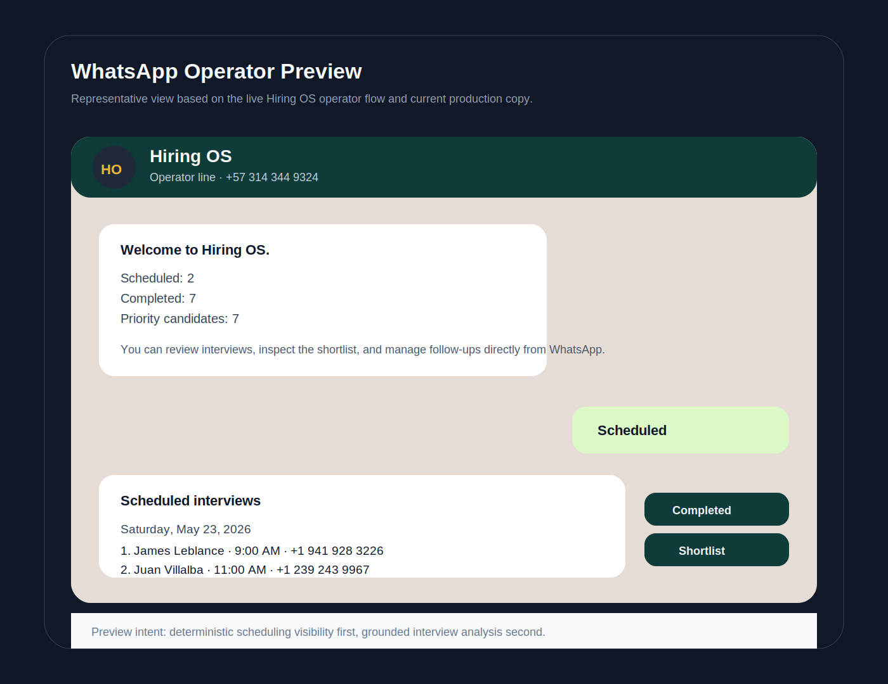
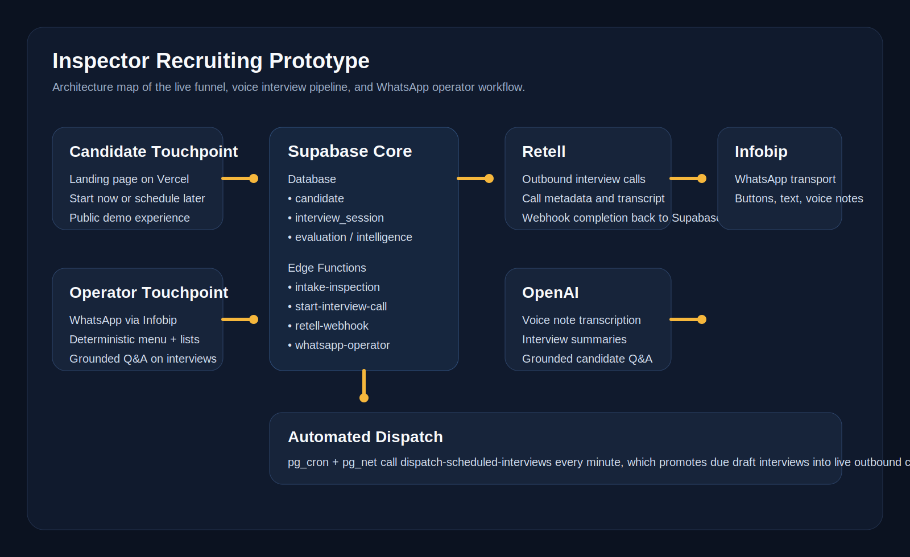

# Portfolio Case Study

## Project Summary

This prototype demonstrates a recruiting workflow for field inspectors that combines:

- a focused landing page
- immediate or scheduled interview calls
- persisted interview and evaluation data
- a WhatsApp-based operator console

The result is a commercially believable prototype that proves both the candidate journey and the internal operations layer.

Live demo touchpoints:

- Landing page: [home-insp-inter.vercel.app](https://home-insp-inter.vercel.app/)
- WhatsApp operator: [`+57 314 344 9324`](https://wa.me/573143449324)

Visual references:

## The Business Need

A hiring team may want to validate whether a niche recruiting flow can work before building a full platform. In this case, the questions were:

- Can we attract the right inspector candidates with a simple landing page?
- Can candidates self-initiate or schedule interviews without human coordination?
- Can interview outcomes persist in a structured way?
- Can operators review progress through WhatsApp instead of depending on a custom admin UI?

## What Was Built

- Inspector recruiting landing page
- Intake flow for `call_now` and `schedule_call`
- Supabase persistence for candidate and interview records
- Outbound interview initiation through Retell
- Interview completion pipeline into structured intelligence
- WhatsApp operator with deterministic menus and grounded candidate reporting
- Automatic dispatch path for due scheduled interviews

## Why This Is Valuable

This prototype is useful because it compresses product, workflow, integration, and operations validation into one system. It shows that a prospective client does not always need a full SaaS platform to learn whether a business process is viable.

It also demonstrates a pattern that is highly reusable:

- public funnel
- structured intake
- AI-assisted workflow
- operational visibility in a familiar channel

## Technical Decisions That Matter

- Determinism owns navigation and factual list responses in WhatsApp.
- The LLM is used for summarization and grounded Q&A, not for inventing workflow state.
- Scheduled interviews are persisted in the same system of record as immediate interviews.
- Cron-triggered interview dispatch is handled inside Supabase instead of adding another infrastructure service.

## What This Shows About The Build Style

This repository is a good example of high-speed, high-clarity prototype delivery:

- narrow but commercially meaningful scope
- real integrations, not fake end states
- enough polish to support demos and stakeholder confidence
- enough internal documentation to keep implementation stable under pressure

## Next Logical Evolution

If this prototype moved into a fuller product, the next steps would likely be:

- authenticated internal dashboard
- richer scheduling management
- deeper candidate pipelines and recruiter actions
- audit trails and admin tooling
- stronger secret handling and environment abstraction across tenants
